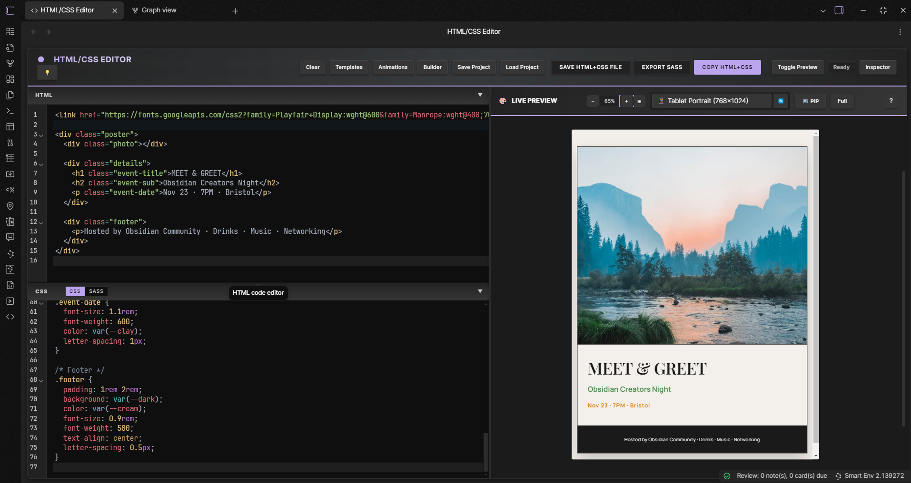
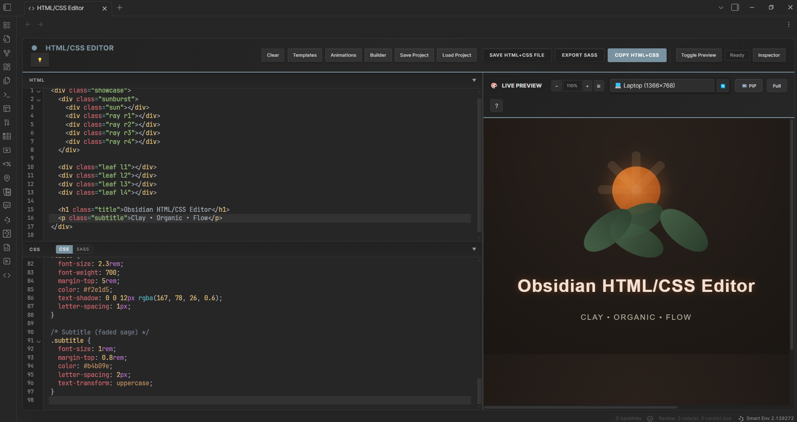
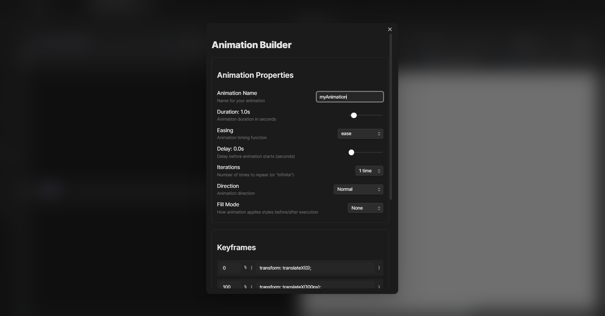

# HTML/CSS Editor for Obsidian

Write HTML and CSS, see it live.

<!-- TODO: Add hero screenshot/GIF of the full app interface -->
<!-- Suggested: full-app-demo.gif - Show the complete interface with HTML/CSS editors and live preview -->
 

## Important Note

This is a fun project for quick prototyping and learning. It's not meant to replace your actual IDE or development environment. For serious web development work, stick with VS Code, WebStorm, or your preferred professional tools.

## Why I Made This

I got tired of switching between Obsidian and CodePen just to test a quick CSS idea. So I built this plugin to turn Obsidian into a simple code playground.

Use it for:
- Testing CSS ideas quickly
- Learning web development
- Making examples for your notes
- Quick prototypes

## What It Does

### The Basics
- Write HTML and CSS side by side
- See your changes instantly in the preview
- Export to files or copy to clipboard
- Works with your Obsidian theme

### Sass Support
Yeah, it does Sass too. Variables, mixins, nesting - all that good stuff. Plus you get autocomplete and can see the compiled CSS output.

### Color Picker
Click any color in your CSS to change it visually. No more guessing hex codes.

### Animations
- 20+ ready-made animations (fade, bounce, slide, etc.)
- Build custom animations with a visual editor
- See how smooth your animations are running

### Responsive Testing
Test your designs on different screen sizes - iPhone, iPad, Desktop, or make your own custom size. Rotate between portrait and landscape with one click.

### Pan and Zoom
- Spacebar + drag to pan around
- Ctrl + scroll to zoom in/out
- Sometimes it's easier to just use the scroll, I will work on improving this later in time
- Zoom buttons for precise control (5% increments)
- Double-click to center

### Save Your Work
Save projects as markdown files anywhere in your vault. Load them back anytime. They're just regular notes with code blocks, so you can edit them normally too.

## Pics

<!-- TODO: Add screenshot of the full interface in use -->
<!-- Suggested: app-in-use.png - Show the complete app with some example HTML/CSS and preview -->







### Getting Started
1. Open the plugin (ribbon icon or command palette)
2. Write some HTML in the top editor
3. Add CSS in the bottom editor
4. Watch it update live on the right

### Sass Mode
Toggle the CSS/Sass switch to use Sass. You get variables, mixins, nesting - the works. Click "Templates" for common patterns.

### Colors
Click any color swatch in your CSS to open a color picker.

### Animations
- Click "Animations" to browse 20+ presets
- Click "Builder" to make custom animations
- Click "Inspector" to see performance stats

### Responsive Testing
Use the device dropdown to test different screen sizes. Click the rotate button to flip between portrait and landscape.

### Navigation
- **Ctrl + scroll** to zoom in/out
- **Double-click** to center the preview
- **+/-** buttons for precise zoom (5% steps)

### Saving Projects
Press "Save Project", give it a name, pick a folder. It saves as a markdown file you can edit like any other note.

### Shortcuts 

##### This may not work depedning on your OS. I'm using Windows 10.
- `Ctrl+S` - Save as HTML file
- `Ctrl+Shift+C` - Copy to clipboard
- `F5` - Refresh preview

### Tips
- Drag the divider to resize panels
- Use Picture-in-Picture to keep preview visible while coding
- The preview updates as you type (with a tiny delay so it's not crazy)
- Projects are just markdown files with code blocks - edit them however you want

## Installation

### Easy Way (Coming Soon Hopefully)
Search for "HTML/CSS Editor" in Obsidian's community plugins.

### Manual Way
1. Download the latest release from [GitHub](https://github.com/Daniel-Hillman/obsidian-html-css-editor/releases)
2. Extract it to `{YourVault}/.obsidian/plugins/`
3. Restart Obsidian
4. Enable it in Settings

Just grab the release files, not the source code.

## Development

If you want to mess with the code:

```bash
git clone https://github.com/Daniel-Hillman/obsidian-html-css-editor.git
cd obsidian-html-css-editor
npm install
npm run build
```

## Ideas for Later

Future potential additions:
- JavaScript support
- Export to CodePen
- More animation stuff
- Whatever people ask for

No promises though.

## Contributing

Open an issue or send a pull request. I'm pretty open about contributions.

## License

MIT - do whatever you want with it.

---

Thanks to the Obsidian team for making the best note-taking app everrrrrr.